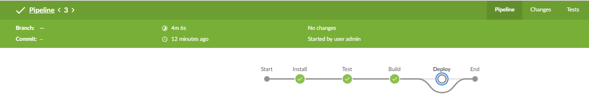
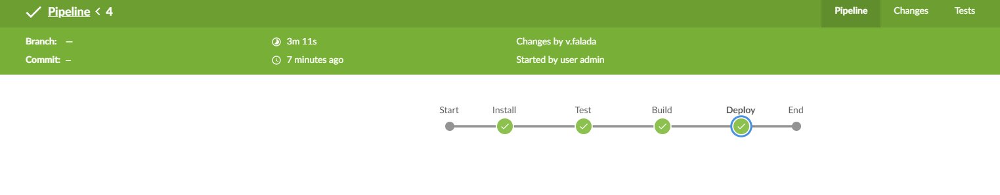

## TADNL error solution info
Presentation issue in Jenkins cause:
  - Connection issue caused first run timeout and the job was killed
  - It caused that some locks remained in the workspace
  - Solution for such problem was to cleanup workspace or delete the job and create new one
  
Fixed run from feature branch:
<p align="center">

  
</p>

Fixed run from master branch:
<p align="center">

  
</p>

## Build/Run
- Source code of the React app is based on "react-shopping-cart" app made under MIT license by Jefferson Ribeiro
- App is deployed to [Firebase](https://tadnl2019.firebaseapp.com)

#### Requirements

- Node.js
- NPM

```javascript

/* First, Install the needed packages */
npm install

/* Then start both Node and React */
npm start

/* To run the tests */
npm run test

/* Build sources */
npm run build

/* Running e2e tests */
npm run wdio

/* Deploy to Firebase */
./node_modules/.bin/firebase deploy --token=$FIREBASE_DEPLOY_TOKEN


```

## About tests .

- Unit tests
  - All components have at least a basic smoke test
- Integration tests
  - Fetch product and add to cart properly
- e2e
  - Webdriverio - Add and remove product from cart

### Copyright and license

The MIT License (MIT). Please see License File for more information.
